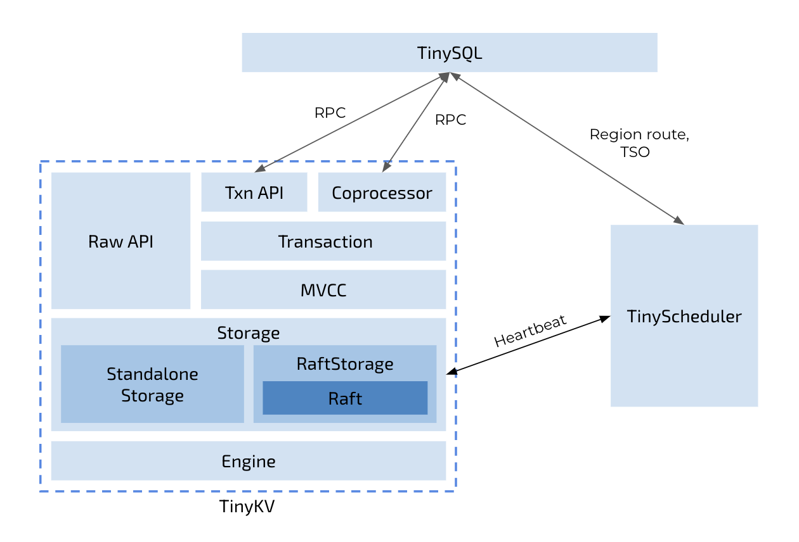

# TinyKv最终展示

## 通过情况

截至8月20日提交：
除3b外，其他关卡均100%通过。
3b测试40次，通过情况如下：
|  test   | 通过率                      |
|------------|------------------------------|
| TestTransferLeader3B  | 100%|
 |TestBasicConfChange3B|100%|
 |TestConfChangeRemoveLeader3B|100%|
 |TestConfChangeRecover3B|100%|
 |TestConfChangeRecoverManyClients3B|100%|
 |TestConfChangeUnreliable3B|100%|
 |TestConfChangeUnreliableRecover3B|100%|
 |TestConfChangeSnapshotUnreliableRecover3B|100%|
 |TestConfChangeSnapshotUnreliableRecoverConcurrentPartition3B|100%|
 |TestOneSplit3B|100%|
 |TestSplitRecover3B|100%|
 |TestSplitRecoverManyClients3B|100%|
 |TestSplitUnreliable3B|100%|
 |TestSplitUnreliableRecover3B|100%|
 |TestSplitConfChangeSnapshotUnreliableRecover3B|90%|
 |TestSplitConfChangeSnapshotUnreliableRecoverConcurrentPartition3B|95%|

 报错为：meta corruption detected，request timeout
 提交后又进行了一些debug尝试，现在出错率为：1/60，正确率：98.3%，报错：find no region for xxx

## 完成过程

第一周：golang语言学习，环境配置，project1，raft论文，project2a逻辑实现
第二周：project2a，project2b
第三周：project2c，3a，4a
第四周：project4+project3b逻辑实现
最后一次组会时完成到这里。
8月2日后：完成3c，主要调试3b。

## 设计亮点

两个结点leader被移除后重复选举的问题：
采取多发几条（5条），因为heartbeat不用来更新commit，使用的是append消息。这里我用本来用不到的reject字段来区分正常的append和用来debug的消息（工程代码）。
并且不进行回应（不让他发response），仅仅用来更新commit。否则连续多次的条件造成的连锁反应可能会增大程序压力。（leader更新match，next，commit甚至重新发append）

## 个人感想

这是本人第一次做大项目，提供代码框架，阅读代码就是巨大的挑战，冗长的调用链我深挖之后，忘得一干二净，之后自己画出调用链并进行标记才有效果。系统架构上，层层的包装，自底向上时有些疑惑，也遇到了一些麻烦。

#### 最大的收获:深入了解了raft算法并成功实现

第一次接触分布式系统相关内容。分布式系统真是一个很有趣的东西。曾经我简单涉猎过分布式系统，知道它可以通过多副本、或者采用RS码等Erasure Code来保证可靠性，但是一想到需要考虑到的多种小概率事件，结点故障，网络故障，并发和各种复杂交互带来的问题，同步/异步的问题，就感到无从下手。这次的raft共识算法用复制状态机理论和过半票决思想，在分布式系统的深海中建起一条任其暗流涌动的海底隧道，令我折服。

project3B的debug也是很特别的经历，跑代码，查看和分析log，猜测哪一环节出现了小概率问题，修改代码尝试解决，旧的bug还没解决，又出现了新的bug，多次修改后仍无法解决，只好回退代码到原点尝试另辟蹊径。从初期的100%报错的不解与烦躁，到成功跑出一次bug free的欣喜，再后来多次重复几乎无bug的释然。回想这一路，也是蛮有成就感的。

可能是能力所限，在完成项目的过程基本与顺利无关，进度也不快，组会上听着大家讲着超出我进度的内容，很多时候听不太懂，之后有意识地进行了截屏和录屏，后来做到相关内容开始debug时看看大家的经验，也着实帮助了我少走了很多弯路，非常感谢。