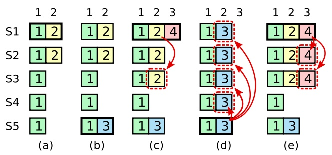
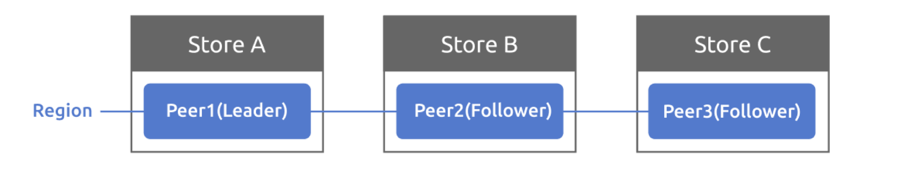

# project1
需要实现Standalone Storage。不同于之后实现的分布式存储引擎，这是一个单机的存储引擎，有助于初学者快速了解相关概念，也易于上手。
## Column Family
> Column Family，简称CF，就是将多个列合并为一个CF进行管理。这样读取一行数据时，你可以按照 CF 加载列，不需要加载所有列（通常同一个CF的列会保存在同一个文件中，所以这样有很高的效率）。此外因为同一列的数据格式相同，你可以针对某种格式采用高效的压缩算法。

对于我们要实现的KV数据库，key和value都是字符串类型，需要支持多列，如下所示：
|KEY|default|write|lock|
|---|---|---|---|
|key|v1|v2|v3|

当需要支持多列时，我们在key前面加一个前缀，如下所示：
|KEY|VALUE|
|---|---|
|default_key|v1|
|write_key|v2|
|lock_key|v3|

这样我们就可以用对key进行修饰来存储各列内容。

## Project1A
任务：完成StandAloneStorage的定义，实现NewStandAloneStorage、Reader和Write函数。

此处的主要任务在于理解概念。

根据项目文档，engine_util包 （kv/util/engine_util​）中提供了所有的读写操作，即需要封装的API。
查看其中doc文件内容，可以看到其中包含三个包，engines是存储引擎、write_batch是将多个写入整合到一个batch中，cf_iterator则是在badger中迭代列族。
对于engine类型，其中包含两个badger.DB类型的指针，两个string代表其路径。
``` go
type Engines struct {
	Kv     *badger.DB
	KvPath string
	Raft     *badger.DB
	RaftPath string
}
```
StandAloneStorage是Storage接口的具体实现，此外该接口还包含RaftStorage和MemStorage。
``` go
type Storage interface {
	Start() error
	Stop() error
	Write(ctx *kvrpcpb.Context, batch []Modify) error
	Reader(ctx *kvrpcpb.Context) (StorageReader, error)
}
```
此处选择将StandAloneStorage作为engines的封装，包含一个engine_util.Engines​成员。

NewStandAloneStorage根据config初始化StandAloneStorage。先从conf中取得dbPath，并生成kvpath和raftpath，调用两次CreateDB得到kvdb和raftdb，最后调用NewEngines生成引擎。

接下来实现接口函数，其中Start直接返回nil即可，Stop调用engine的Close方法。

Write函数进行engine实际的写操作，接受两个参数ctx *kvrpcpb.Context​和batch []storage.Modify，其中第一个参数无需使用。
查看参数定义，如下所示。
``` go
type Modify struct {
  Data interface{}
}

type Put struct {
  Key   []byte
  Value []byte
  Cf    string
}

type Delete struct {
  Key []byte
  Cf  string
}

func (m *Modify) Key() []byte {
  switch m.Data.(type) {
  case Put:
    return m.Data.(Put).Key
  case Delete:
    return m.Data.(Delete).Key
  }
  return nil
}

func (m *Modify) Value() []byte {
  if putData, ok := m.Data.(Put); ok {
    return putData.Value
  }

  return nil
}

func (m *Modify) Cf() string {
  switch m.Data.(type) {
  case Put:
    return m.Data.(Put).Cf
  case Delete:
    return m.Data.(Delete).Cf
  }
  return ""
}
```
Modify​中可以是类型为Put​或Delete​类型的Data​，使用.Key().Cf().Value()​取对应的字段。
实现时只需要遍历Modify切片，根据每个Modify执行put或delete操作即可。

Reader 方法，该方法返回一个 StoreageReader 接口，我们首先需要实现这个接口。
``` go
type StorageReader interface {
	// When the key doesn't exist, return nil for the value
	GetCF(cf string, key []byte) ([]byte, error)
	IterCF(cf string) engine_util.DBIterator
	Close()
}
```
根据文档提示，使用badger.txn来实现StoreageReader，定义一个StandAloneReader作为badger.txn的封装，并分别使用engine_util.GetCFFromTxn​、engine_util.NewCFIterator​、txn.Discard​实现GetCF()、IterCF()、Close()​。

回到StandAloneStorage的Reader函数，此处只需要调用en.Kv.NewTransaction​创建一个txn​，然后构造并返回一个StandAloneStorageReader​即可。
## Project1B
此处我们需要对StandAloneStorage进行一层封装，实现一个 K-V service handler，让读写操作以 API 的方式暴露出去供上层使用。这里要完善代码 kv/server/raw_api.go，其中包括 RawGet 、RawScan、RawPut、RawDelete。
四种方法接受对应的request，返回对应response和err。

对于get请求，使用Reader的GetCF方法；对于put和delete操作，将收到的请求转化为Modify切片并调用Write方法。只有RawScan稍显复杂，需要使用Reader​的迭代器iter遍历，首先Seek​到StartKey​的位置，然后取至多limit​个kvPairs​，用iter->Valid()检查是否有效，iter.Next()​进行遍历。

注：熟悉这四种操作的流程，在project4中也会涉及。

## debug
在StandAloneStorageReader，GetCF实现时，注意若出现badger.ErrKeyNotFound，需要返回nil，nil，上层会检测value是否为nil来判断是否出现badger.ErrKeyNotFound错误。
``` go 
if err == badger.ErrKeyNotFound {
		return nil, nil
	}
```

# project2
## project2a
该部分需要完成raft库的实现，分为2aa领导选举，2ab日志复制，2ac rawNode三个部分。
整体上，从上层到下层依次为rawNode，raft模块和raftlog。

- **rawNode**：该模块用来接收上层传来的信息，将信息下传给 Raft 模块。同时接受 Raft 的同步结果然后传递给上层。RawNode 要负责检查 Raft 模块是否已有同步好的日志需要应用、是否有 Msg 需要发送、是否有日志需要持久化等等，然后把这些信息（Ready）交给上层，上层会据此进行处理。
- **raft**：这是raft算法的具体实现层，领导人选举、日志复制、角色转换等等均是在这里实现
- **raftlog**：用来存储节点的日志信息，不仅存储条目本身，同时还要维护一些信息，如 committed、applied 等等。

### project 2aa 2ab
此处需要实现领导选举和日志复制。
#### raft模块
Raft类定义各成员解析如下：

- **id**：节点id
- **Term**：任期
- **Vote**：当前任期投票给了谁
- **RaftLog**：缓存日志条目
- **Prs**：用于leader维护各节点日志复制的进度（Match代表已经匹配的Index，Next代表即将发送的下一个Index）
- **State**：节点状态
- **votes**：记录投票信息
- **msgs**：需要发送的消息，消息分本地消息（本节点处理）和普通消息
- **Lead**：只想当前的leader
- **heartbeatTimeout**：心跳超时。当heartbeatElapsed>=heartbeatTimeout时即超时。
- **electionTimeout**：选举超时，超时判断同上。
- **heartbeatElapsed**：记录距上次心跳超时经过的时间，用于判断是否心跳超时
- **electionElapsed**：记录，用于判断是否选举超时
- **leadTransferee**、**PendingConfIndex**：在3A领导权转移和配置变更中使用，此处忽略
##### newRaft
使用conf中的内容来初始化raft，注意使用storage的newlog来raftlog，用Storage.InitialState()得到hardState和confState，按照释义初始化其他成员，注意msg需要初始化为nil而非空切片。
##### becomexxx
三个身份转换函数，分别对应Follower，Candidate，Leader。

- becomeFollower​：需要更新Vote​、State​、Term​、Lead​，清空votes​、leadTransferee​，重置两个超时时间，最后随机化选举超时。

- becomeCandidate​：根据Raft算法，要自增Term​，然后先投票给自己（如果当前集群只有一个节点，直接becomeLeader​）。也要重置超时，随机化选举超时。按理说，一旦成为 candidate，会立刻向所有节点发送请求，但是在step()处理msghup发起选举的时候candidate才会发送投票请求。

- becomeLeader：除了状态的设置和各结构体成员的重置，还需要初始化r.Prs中各peer的next和match，becomeLeader的同时发送空日志，最后尝试更新commit。

##### tick()
这是一个逻辑时钟，会对electionElapsed和heartbeatElapsed（leader）进行自增，并检测两者是否达到超时条件。
若选举超时，则将electionElapsed置零后尝试发起选举。
若Leader心跳超时，则将heartbeatElapsed置零后发送心跳。
##### Step()
Step​结合当前节点身份状态r.State​和消息类型MsgType​选择要执行的动作。这部分是实现Raft层的重点，首先要理解各个Msg的作用以及含义。

文档中提到，对于一个Raft节点来说，Msg分本地消息和普通消息，其中普通消息是要发给其他节点的，要放到r.msgs​中供上层异步地取用；本地消息是本地发起的，因此套个Step()​直接进行消息处理。之前在tick()​中发起的就是本地消息MsgHup​和MsgBeat。

首先根据当前结点身份状态，分为XXXStep。之后再根据MsgType执行对应的处理程序，其处理程序是重点，将在接下来的msg处理进行阐述。
#### Raftlog
Raftlog结构体各成员释义如下所示：
- **storage**：自从上次快照以来，所有的持久化条目；
- **commited**：论文中的 committedIndex，即节点认为已经提交的日志 Index；
- **applied**：论文中的 lastApplied，即节点最新应用的日志 Index；
- **stabled**：节点已经持久化的最后一条日志的 Index；
- **entries**：所有未被 compact 的日志，包括持久化与非持久化；
- **pendingSnapshot**：待处理快照，在project2c中使用；
- **lastAppend**：该字段是我自己加的，用于节点记录上一条追加的日志 Index，因为在 follower 更新自己的 committed 时，需要把 leader 传来的 committed 和其进行比较；

关于applied、committed、stabled之间关系，以及在entries中位置示意如下所示：

 snapshot/first.....applied....committed....stabled.....last
  --------------|-------------------log entries----------------------|

  其中log entries从上次snapshot被截断的部分（truncated Index）之后开始。

需要实现的方法如下：

- newLog
- unstableEntries
- nextEnts
- LastIndex
- FirstIndex
- Term

其中newLog根据参数storage来初始化raftlog，其中firstIndex,lastIndex,entries,hardState都通过调用storage方法来获取，之后填写结构体内容即可。
此外其他方法，只要按照注释的要求实现，分清楚log中applied、committed、stabled等概念去实现就好，这里不再赘述。

#### msg处理
Msg 分为 Local Msg 和 Common Msg。前者是本地发起的 Msg，多为上层传递下来的，比如提交条目、请求心跳、请求选举等等，这些 Msg 不会在节点之间传播，它们的 term 也相应的等于 0。后者就是节点之间发送的 Msg，用来集群之间的同步。

TinyKV 通过 pb.Message 结构定义了所有的 Msg，根据MsgType 来区分不同 Msg ，不同Msg的同一成员的释义可能不同。

下面将根据msgType依次分析如何处理。

##### MsgHup

Local Msg，用于请求节点开始选举，可以加入from和to，但是没必要。

| 成员    | 作用                  |
| ------- | --------------------- |
| MsgType | 不用于节点间通信，仅用于发送给本节点让本节点进行选举 |

当节点收到该 Msg 后，会进行相应的判断，如果条件成立，即刻开始选举。判断流程大致为：

1. 判断 r.Prs[r.id] 是否存在。由于网络原因，可能节点收到 MsgHup 之前，自己已经被移除了，此时直接返回即可；
2.判断是否有 pendingSnapshot。如果正在 applying snapshot，则不要发起选举，因为一定是其他的 leader 发给你 snapshot，如果你发起选举，你的 term+1 必定大于现有的 leader，这会造成集群的不稳定。
3. 判断 region 中是否只有自己一个节点。如果是，不用选举，直接成为 Leader。
4. becomeCandidate；
5. 向其他所有节点发送 MsgRequestVote；

##### MsgBeat

Local Msg，用于告知 Leader 该发送心跳了，仅仅需要一个成员。

| 成员    | 作用                     |
| ------- | ---------------------- |
| MsgType | pb.MessageType_MsgBeat |

当 Leader 接收到 MsgBeat 时，向其他所有节点发送心跳。而非 Leader 接收到 MsgBeat 时，直接忽略。

##### MsgPropose

Local Msg，用于上层请求 propose 条目。成员如下：

| 成员    | 作用                      |
| ------- | ------------------------- |
| MsgType | pb.MessageType_MsgPropose |
| Entries | 要 propose 的条目         |
| To      | 发送给哪个节点            |

该 Msg 只有 Leader 能够处理，其余角色收到后直接返回 ErrProposalDropped。Leader 的处理流程如下：

1. 判断 r.leadTransferee 是否等于 None，如果不是，返回 ErrProposalDropped，因为此时集群正在转移 Leader（3A）；
2. 把 m.Entries append到自己的 Entries 中；
3. 向peers发送追加日志 RPC，即 MsgAppend，用于集群同步；
4. 如果集群中只有自己一个节点，则直接更新自己的 committedIndex；

##### MsgAppend

Common Msg，用于 Leader 给其他节点同步日志条目，成员如下：

| 成员    | 作用                                                      |
| ------- | --------------------------------------------------------- |
| MsgType | pb.MessageType_MsgAppend                                  |
| To      | 目标节点                                                  |
| From    | 当前节点id（LeaderId）                                      |
| Term    | 当前节点的 Term                                           |
| LogTerm | 要发送的条目的前一个条目的 Term，即论文中的 prevLogTerm   |
| Index   | 要发送的条目的前一个条目的 Index，即论文中的 prevLogIndex |
| Entries | 要发送的日志条目                                          |
| Commit  | 当前节点的 committedIndex                                 |


处理流程如下：

1.任期检查。Msg的Term若大于自己的Term，说明自己任期落后，更新任期；若小于，说明该消息落后，拒绝。
2.状态检查。若state为candidate，则becomefollower；若为leader，拒绝（这种情况不应该发生）。
3.领导人检查。若自己的lead与Msg发送者不同，则将其改为Msg.from。
4.日志匹配检查。若prevLogIndex > r.RaftLog.LastIndex()或接收者日志中没有包含这样一个条目：即该条目的任期在 prevLogIndex 上能和 prevLogTerm 匹配上，则拒绝。
5.追加新条目，同时删除冲突条目，冲突条目的判别方式和论文中的一致。
6.更新commit，并接受，返回MsgAppendResponse。

前三点的检查会在代码中多次出现，之后不再详述。

注意：不论是接受还是拒绝，都要返回一个 MsgAppendResponse 给 Leader，让 Leader 知道追加是否成功并且更新相关信息。

##### MsgAppendResponse

Common Msg，用于节点告诉 Leader 日志同步是否成功，和 MsgAppend 对应，结构体成员如下：

| 成员    | 值                                                         |
| ------- | ---------------------------------------------------------- |
| MsgType | pb.MessageType_MsgAppendResponse                           |
| Term    | 当前节点的 Term                                            |
| To      | to                                                         |
| Reject  | 是否拒绝                                                   |
| From    | 当前节点的 Id                                              |
| Index   | r.RaftLog.LastIndex()；该成员用于 Leader 更快地去更新 next |

发送：

1不管节点接受或是拒绝，都要发送一个 MsgAppendResponse 给 Leader，调整 Reject 成员即可，其他成员固定；

接收与处理：

1. 只有 Leader 会处理该 Msg，其余角色直接忽略； 
2. 如果被 reject 了，那么重置 next。重置规则为将旧的 next --，然后比较 m.Index + 1，最后取小的那个赋值给 next，然后重新进行日志 / 快照追加；
3. 如果没有 reject，则更新 match 和 next。next 赋值为 m.Index + 1，match 赋值为  next - 1 ；
4. 按照论文的思路更新 commit。即：假设存在 N 满足N > commitIndex，使得大多数的 matchIndex[i] ≥ N以及log[N].term == currentTerm 成立，则令 commitIndex = N。

##### MsgRequestVote

Common Msg，用于 Candidate 请求投票，成员如下：

| 成员    | 值                            |
| ------- | ----------------------------- |
| MsgType | pb.MessageType_MsgRequestVote |
| Term    | 当前节点的 Term               |
| LogTerm | 节点的最后一条日志的 Term     |
| Index   | 节点的最后一条日志的 Index    |
| To      | 发给谁                        |
| From    | 当前节点的 Id                 |

发送：

1. 当节点开始选举并成为 Candidate 时，立刻向其他所有节点发送 MsgRequestVote；

接收与处理：

1. 任期检查。判断 Msg 的 Term 是否大于等于自己的 Term，若是则更新term和voteFor，否则拒绝；注意节点在每个任期有且仅有一票。
2. 如果 votedFor 不为空或者不等于 candidateID，则说明该节点以及投过票了，直接拒绝。否则往下；
3. Candidate 的日志至少和自己一样新，那么就给其投票，否则拒绝。新旧判断逻辑如下：
   - 如果两份日志最后的条目的任期号不同，那么任期号大的日志更加新
   - 如果两份日志最后的条目任期号相同，那么日志比较长的那个就更加新；

Candidate 会通过 r.votes 记录下都有哪些节点同意哪些节点拒绝，每次收到MsgRequestVoteResponse都会统计票数，当同意的票数过半时，即可成为 Leader，当拒绝的票数过半时，则转变为 Follower。

##### MsgRequestVoteResponse

Common Msg，用于节点告诉 Candidate 投票结果，成员如下：

| 成员    | 值                                     |
| ------- | -------------------------------------- |
| MsgType | pb.MessageType_MsgRequestVoteResponsev |
| Term    | 当前节点的 Term                        |
| Reject  | 是否拒绝                               |
| To      | 发给谁                                 |
| From    | 当前节点 Id                            |

发送：

1. 节点收到 MsgRequestVote 时，会将结果通过 MsgRequestVoteResponse 发送给 Candidate；

接收与处理：

1. 只有 Candidate 会处理该 Msg，其余节点收到后直接忽略；
2. 根据 m.Reject 更新 r.votes[m.From]，即记录投票结果；
3. 算出同意的票数 agrNum 和拒绝的票数 denNum；
4. 如果同意的票数过半，那么直接成为 Leader；
5. 如果拒绝的票数过半，那么直接成为 Follower；


##### MsgHeartbeat

Common Msg，即 Leader 发送的心跳。不同于论文中使用空的追加日志 RPC 代表心跳，TinyKV 给心跳一个单独的 MsgType。其成员如下：

| 成员    | 值                          |
| ------- | --------------------------- |
| MsgType | pb.MessageType_MsgHeartbeat |
| Term    | 当前节点的 Term             |
| Commit  | util.RaftInvalidIndex       |
| To      | 发给谁                      |
| From    | 当前节点 ID                 |

其中，Commit 成员必须固定为0，与project3B中confchange内容有关。不要用心跳的Commit来更新peer的commit。

发送：

1. 每当 Leader 的 heartbeatTimeout 达到时，就会给其余所有节点发送 MsgHeartbeat；

接收与处理：

1. 任期检查。
2. 重置选举计时  r.electionElapsed
3. 发送 MsgHeartbeatResponse

##### MsgHeartbeatResponse

Common Msg，即节点对心跳的回应。成员如下：

| 成员    | 值                                  |
| ------- | ----------------------------------- |
| MsgType | pb.MessageType_MsgHeartbeatResponse |
| Term    | 当前节点的 Term                     |
| To      | 发给谁                              |
| From    | 当前节点 ID                         |
| Commit  | 当前节点的 committedIndex           |

其中，Commit 成员用于告诉 Leader 自己是否落后。

发送：

1. 当节点收到 MsgHeartbeat 时，会相应的回复 MsgHeartbeatResponse；

接收与处理：

1. 只有 Leader 会处理 MsgHeartbeatResponse，其余角色直接忽略；
2. 通过 m.Commit 判断节点是否落后了，如果是，则进行日志追加；

**MsgSnapshot**在2c中使用，**MsgTransferLeader**、**MsgTimeoutNow**在project3中使用，在此不再叙述。


#### 注意事项
##### 测试要求 msg 是nil，而不是空切片

TestRawNodeRestartFromSnapshot2C 中，want 里的 msg 为 nil，即测试点预期 newRaft 处的 msg 应该为 nil，而不是 make 一个空切片。

##### becomeCandidate不会发送投票

按理说，一旦成为 candidate，会立刻向所有节点发送请求，但是在step()处理msghup发起选举的时候candidate才会发送请求。

##### becomeLeader的同时发送空日志
可以用于更新prs中follower的记录，同时更新follower commit。这与安全性相关，即新leader不负责之前任期的提交更新，但可以用新的一条日志保护起来，使得前一条提交。

raft在当前任期内能够commit之前任期中已经复制给大多数节点但没有commit的日志条目吗?

Raft 永远不会通过计算副本数目的方式去提交一个之前任期内的日志条目。只有领导者当前任期里的日志条目通过计算副本数目可以被提交；**一旦当前任期的日志条目以这种方式被提交，那么由于日志匹配特性，之前的日志条目也都会被间接的提交。**


##### 只有一个结点时直接成为leader
leader在接受到RequestVoteResponse之后统计票数，但是当只有一个结点时没有发出requestVote，自然没有response。需要特别考虑该情况。
##### leader更新commit后发送append来更新follower的commit

##### handleAppendEntry中条目的删除
删除冲突条目后,要注意冲突条目可能存储到storage中，注意修改stable值
##### 切片边界检查
log中函数的实现，如term，切片左闭右开；注意下溢（ok）
storage.Entries(firstIndex, lastIndex+1)后面需要加1

#### 感受：
1.raft很复杂，理清思路，想好再写。
2.注意模块化编程清楚调用关系，理解函数用途。

### 2ac rawnode
RawNode是raft库的接口，把raft库作为一个黑箱来看，其输入是Propose，传递一个消息，其输出是Ready，将会返回一个Ready结构体，从而可以持久化日志和进行apply。

``` go
// RawNode is a wrapper of Raft.
type RawNode struct {
	Raft *Raft
	// Your Data Here (2A).
	PreSoftState *SoftState
	PreHardState pb.HardState
}
```

加入了两个新成员，PreSoftState和PreHardState，用来判断raft是否有更新。

当客户端需要向raft中发送消息时，他会调用Propose，其调用Step处理Msg。客户端将会不断地调用HasReady，判断出是否有需要处理的数据被更新，如果有那么调用Ready将这些数据通过Ready结构传递出来。在对Ready进行处理之后，会调用Advance告知raft某个Ready已经被处理，在raft中可以更新对应结构了。

Ready​结构体成员如下：

- SoftState​：包含Lead​和RaftState；
- pb.HardState​：包含Term​、Vote​、Commit；​
- Entrise​：存放还没持久化的所有条目
- Snapshot​：存放需要应用的snapshot
- CommittedEntries​：存放已经提交但是还没有被应用的日志条目
- Messages​：存放raft节点中需要转发的一些消息（RequestVote、AppendEntries等等）


需实现的函数：
#### NewRawNode
使用参数config调用newraft()来初始化raft，将初始的softstate和hardstate作为PreSoftState、PreHardState。

#### HasReady
检查是否存在ready供上层更新。如果 HasReady() 返回 true，那么上层就会调用 Ready()。
检查时就按照结构体成员的含义，逐一检查是否由需要更新的地方，只要有任何一个成员需要更新便返回true。

需更新的有：SoftState，HardState，unstable entries的存储，已committed未apply的日志的apply，msg的处理。

其中SoftState和HardState​需要和PreSoftState、PreHardState比较来判断是否更新，并记得及时更新PreSoftState、PreHardState。

#### Ready
按照释义为ready各成员赋值，返回一个ready结构体。
注意Ready中SoftState在（SoftState）无更新时值为nil，HardState在(HardState)无更新时为nil。而不是整体上无更新(!HasReady())。这是一处文档中稍有歧义的地方。
#### Advance
当上层处理完 Ready 后，调用 Advance() 来推进整个状态机。

执行advance时，认为上层函数已经完成了ready提供的所有需要更新的部分，而RawNode中的raft还没有进行对应的更新。更新hardstate，stable，apply，以及msg置空即可，softstate在处理上层msg时已经更新了。

#### debug：
主要是理解有误，注意Ready中SoftState在（SoftState）无更新时值为nil，HardState在(HardState)无更新时为nil，两者无联系，不会相互影响，更不是整体上无更新(!HasReady())。
## 2b
project2b需要实现对rawNode之上的应用，peer
首先需要了解Store​, Peer​ 和 Region三个术语。
- Store 代表 tinykv-server 的实例
- Peer 代表运行在 Store 上的 Raft 节点
- Region 是 Peers 的集合，也称为 Raft Group（Region将键空间以范围range划分，是实现Project3 MuitiRaft的关键概念，Project2中默认只有一个Region）


消息自上而下的传输过程如下：
1.client发送请求RaftCmdRequest，并由peer接收。
2.peer将请求以entry的形式传递给下层raft层。（proposeRaftCommand）
3.raft层内部进行同步。（project2a内容）

同时，peer会不时调用hasReady查看raft层是否有需要apply、持久化的内容(HasReady()?)
### Implement peer storage
搞清楚如何持久化，在/kv/raftstore/meta文件夹下有keys.go和values.go，里面分别是存/取所用的方法，在持久化时调用WriteBatch.SetMeta(key,msg)时需传入的key需要使用keys.go的对应函数转化成正确的格式。
PeerStorage 负责该 peer 的存储。TinyKV 这里提供了两个 badger 实例，分别是 raftDB 和 kvDB，每个实例负责存储不同的内容：

raftDB 存储：

- Ready 中需要 stable 的 entries。
- RaftLocalState

kvDB 存储：

- key-value
- RaftApplyState
- RegionLocalState

需要完成的函数：
#### Append()
在SaveReadyState()中调用的函数，用来存储新增的raftlog以及删去不会被提交的raftlog，实现Entries的持久化。
可以分别得到现有的log首尾Index以及ready.entries的首尾Index来判断，依次注意以下情况：

1.需要存储的raftlog已经被截断truncated，无需存储
2.需要存储的raftlog部分被截断
3.删除后面不会被提交的raftlog

#### SaveReadyState()
该函数用来持久化 Ready 中的数据。将raft.Ready​中更新的数据保存到 badger 中（即持久化），包括追加日志条目、保存 Raft HardState、应用Snapshot（2C）等。

1.通过 raft.isEmptySnap() 方法判断是否存在 Snapshot，如果有，则调用 ApplySnapshot() 方法应用（2C）；
2.保存 ready 中的 HardState 到 ps.raftState.HardState，注意先使用 raft.isEmptyHardState() 进行判空；
3.调用 Append() 将需要持久化的 entries 保存到 raftDB；
4.持久化 RaftLocalState 到 raftDB；
5.通过 raftWB.WriteToDB 和 kvWB.WriteToDB 进行底层写入。

### Implement Raft ready process

#### proposeRaftCommand
将client发送的请求（类型为 *raft_cmdpb.RaftCmdRequest）包装成entry，交给raft层去同步。
其第二个参数是Callback类型，下层成功执行后用callback的done方法传入response来通知上层，上层便知道这个请求被执行并得到执行结果。并且如果处理过程中发生了错误，也需要将错误返回，错误通过ErrResp方法封装到RaftCmdResponse结构中。


proposals是用于记录Proposal的callback及任期等信息的结构，每个RaftCommand对应一个proposal，proposals在proposeRaftCommand中被append。每次处理RaftCommand之后会取出一个proposal，然后将返回的错误提交给它，之后会返回给客户端。
若指令正常执行，callback会在HandleRaftReady中使用，传递response。


#### HandleRaftReady
处理 rawNode 传递来的 Ready。
文档中给出了伪代码:
```
for {
  select {
  case <-s.Ticker:
    Node.Tick()
  default:
    if Node.HasReady() {
      rd := Node.Ready()
      saveToStorage(rd.State, rd.Entries, rd.Snapshot)
      send(rd.Messages)
      for _, entry := range rd.CommittedEntries {
        process(entry)
      }
      s.Node.Advance(rd)
    }
}
```
按照伪代码可以得到步骤如下：
1.调用hasReady，若没有Ready则返回。
2.调用 SaveReadyState 将 Ready 中需要持久化的内容保存到 badger。如果 Ready 中存在 snapshot，则应用它；
3.然后调用 d.Send() 方法将 Ready 中的 msg 发送出去；
4.应用 Ready 中的 CommittedEntries；
5.调用 d.RaftGroup.Advance() 推进 RawNode；

其中第四点应用entry过程较为复杂。下为逐一处理entry的步骤：
1.更新appliedIndex。
2.若entry_Type==normal entries，(entry_Type分为normal entries和configuration changes两种，此处只需要考虑normal entries)，使用 Unmarshal 方法将entry.Data解码成RaftCmdRequest结构。
3.遍历RaftCmdRequest中requests切片，根据cmd的类型（put，delete，get）进行分别处理，并分别设置response。
4.需要根据将RaftCmdRequest的处理结果通过proposal的CallBack返回。出现错误则返回错误。
5.写入需要通过engine_util.WriteBatch结果，以批量，原子地形式一次性将变化写入到状态机中（kvdb）


#### debug

##### Snap的回应
runtime error: invalid memory address or nil pointer dereference

虽然直到2b我们还没有实现snapshot的功能，但是测试集会测试req.CmdType == raft_cmdpb.CmdType_Snap时的response，由于snapshot的response含有一个region信息，若不对其赋值则会报错。
##### p.cb.Txn

在完成 Snap 条目的 apply 之后，需要给 p.cb.Txn 赋值一个可读事务。因为在 cluster.go 的 Scan() 方法中，会传给 Raft 一个 SnapCmd，然后通过回应的 txn 来构造迭代器。如果在执行完 SnapCmd 后没有给 p.cb.Txn 赋值，那么就会报 nil pointer 错误，代码如下：
``` go
p.cb.Txn = d.peerStorage.Engines.Kv.NewTransaction(false)
```
## 2c
若不做任何处理，随着我们当前设计的存储系统的长时间运行，Raft节点中的RaftLog会迅速增加，占用大量内存。因此我们需要实现SnapShot机制来对日志进行压缩和删除。
### SnapShot生成
此处不需要我们实现，但可以适当了解。
我们可以通过调用r.RaftLog.storage.Snapshot()来获取快照，而实际上该方法对于SnapShot的生成是异步的。将生成快照任务发送给ps.regionSched，并且将 snapState 的状态改为 Generating 表示正在产生快照。
这是由于快照比较大，可能耗时较长，调用storage.Snapshot()获取快照后，可能暂时无法获得快照，此时会返回err。等到下次再次获取快照时如果快照已经产生了，则会接收并返回快照。
### SnapShot发送与接收
SnapShot作为大量日志的替代品，在raft层的日志同步过程中会被使用到。

在发送entry过程中，可能发送快照：

1.当 Leader 发现要发给 Follower 的 entry 已经被压缩时（ Next < r.RaftLog.FirstIndex() ），就会通过 r.RaftLog.storage.Snapshot() 生成一份 Snapshot，并将生成的 Snapshot 发送给对应节点。
2.SnapShot异步生成，若超时则待下次发送时再次调用，若生成完毕，leader将SnapShot发送给follower。
3.每个节点有个成员叫 pendingSnapshot，为待应用的 Snapshot，如果 leader 发快照时pendingSnapshot 不为nil，直接发pendingSnapshot即可，不然通过第2步生成一个新的发过去。

follower也可能接收快照：

此处需要处理新的msg类型:MsgSnapshot。

**MsgSnapshot**

Common Msg，用于 Leader 将快照发送给其他节点，Project2C 中使用。成员如下：

| 成员     | 值                         |
| -------- | -------------------------- |
| MsgType  | pb.MessageType_MsgSnapshot |
| Term     | 当前节点的 Term            |
| Snapshot | 要发送的快照               |
| To       | 要发给谁                   |
| From     | 当前节点 ID                |

Follower 收到 Leader 发来的 pb.MessageType_MsgSnapshot 之后，会根据其中的 Metadata 来更新自己的 committed、applied、stabled 等等指针。然后将在 Snapshot 之前的 entry 均从 RaftLog.entries 中删除。之后，根据其中的 ConfState 更新自己的 Prs 信息。做完这些操作后，把 pendingSnapshot 置为该 Snapshot，等待 raftNode 通过 Ready( ) 交给 peer 层处理。

### SnapShot应用

在 HandleRaftReady( ) 中，如果收到的 Ready 包含 SnapState，就需要对其进行应用。调用链为HandleRadtReady() -> SaveReadyState() -> ApplySnaptshot()

ApplySnaptshot()实现：
 1.调用ps.clearMeta 和 ps.clearExtraData 来清空旧的数据。
 2.根据 Snapshot的term、index和region 更新 raftState 和 applyState。需要修改的分别为raftState的LastIndex 与 LastTerm 和applyState的AppliedIndex 以及 TruncatedState。
 3.持久化applyState、regionState和raftState。
 4.将snapState.StateType 赋值为 snap.SnapState_Applying
  5.. 生成一个 RegionTaskApply，传递给 ps.regionSched 管道。region_task.go 会接收该任务，然后异步的将 Snapshot 应用到 kvDB 中去。
### 日志压缩
1.在 HandleMsg( ) 会中收到 message.MsgTypeTick，然后进入 onTick( ) ，触发 d.onRaftGCLogTick( ) 方法。这个方法会检查 appliedIdx - firstIdx >= d.ctx.cfg.RaftLogGcCountLimit，如果是，就开始进行压缩。
2.调用proposeRaftCommand( )，将Raft 提交一个raftcmdRequest，包含 一个AdminRequest，类型为 AdminCmdType_CompactLog，将该 AdminRequest 封装成 entry 交给 raft 层来同步。
3.当该 entry 同步完成并需要被 apply 时，HandleRaftReady( ) 开始执行该条目中的命令 。这时会首先修改相关的状态，然后调用 d.ScheduleCompactLog( ) 发送 raftLogGCTask 任务给 raftlog_gc.go。raftlog_gc.go 收到后，会删除 raftDB 中对应 index 以及之前的所有已持久化的 entries，以实现压缩日志。


总的来说，当 entry 数量超过阈值时，就会触发 compactLog，compactLog 删除日志并更新 TruncatedState.Index，接着当 Leader 调用 sendAppend 时，若需要发送的日志被Truncated，才生成 snapshot。
### debug
#### 新增一个空条目
处理完快照之后要注意 lastIndex()实现，可能entries全部删除了，可能存在lastIndex() < snapshot.Metadata.Index，新增一个空条目，与snapshot的index一致。

#### can't get value xxxx for key xxxx 
```
panic: can't get value xxxx for key xxxx [recovered]
```

若出现这样的问题，可能是生成快照后，pendingsnapshot没有同步到engine，可能时没有设置pendingSnapshot，或Ready( )没有加入snapShot的处理。以及Advance()之后别忘了将pendingsnapshot设置为nil。。


# project3
## 3a
在raft层完成leader transfer和conf change的实现。
### Implement leader transfer
此处需要处理新的msg类型，MsgTransferLeader和MsgTimeoutNow，其说明如下：
**MsgTransferLeader**
Local Msg，用于上层请求转移 Leader，Project3 使用。成员如下：

| 成员    | 值                               |
| ------- | -------------------------------- |
| MsgType | pb.MessageType_MsgTransferLeader |
| From    | 由谁转移                         |
| To      | 转移给谁                         |


**MsgTimeoutNow**

Local Msg，节点收到后清空 r.electionElapsed，并即刻发起选举，成员如下：

| 成员    | 值                           |
| ------- | ---------------------------- |
| MsgType | pb.MessageType_MsgTimeoutNow |
| From    | 由谁发的                     |
| To      | 发给谁的                     |

流程：
1.当前leader结点收到MsgTransferLeader
2.leader检查 transferee 合法性，包括id是否合法，日志是否最新。
3.若日志落后，向transferee发送MsgAppend直至日志已更新为最新，注意这段时间内leader不再接受proposal
4.向transferee发送MsgTimeoutNow。
5.transderee接收后立即开始选举。

### Implement conf change

这里使用到类型为EntryConfChange，将其作为普通的entry一样进行复制、commit。当entry提交后，上层就会调用rawNode的addNode、和removeNode方法。这里无需关心调用过程，主要要求实现addNode和removeNode方法。

注意：removeNode执行后，由于结点数量变动，曾经未提交的日志可能存在满足大多数而提交的可能，因此需要更新commit信息。

### debug：

#### leader在Prs不存在
```
=== RUN   TestLeaderTransferToNonExistingNode3A
--- FAIL: TestLeaderTransferToNonExistingNode3A (0.00s)
panic: runtime error: invalid memory address or nil pointer dereference [recovered]
```
解决方法：正如测试样例名，没有考虑到收到该信息的leader在Prs不存在的问题，应提前检查。

#### removeNode中无需在votes中执行remove

```
=== RUN   TestCommitAfterRemoveNode3A
    raft_test.go:1273: expected one committed EntryType_EntryNormal, got []
--- FAIL: TestCommitAfterRemoveNode3A (0.00s)
```

修改：removenode不需要remove votes，只需要在Prs中移除id对应项即可。
或者说，由于votes是一个map[uint]bool,属于原子类型，没有必要用_,ok:=votes[id]检查是否存在某id的映射。

#### follower和candidate要对transferLeader信息进行回应
```
=== RUN   TestLeaderTransferToUpToDateNodeFromFollower3A
    raft_test.go:1458: after transferring, node has state StateLeader lead 1, want state StateFollower lead 2
```
查看代码后发现，测试集中发出的transferLeader msg中from和to是相等的：

```go
    // Transfer leadership to 2.
	nt.send(pb.Message{From: 2, To: 2, MsgType: pb.MessageType_MsgTransferLeader})
```

对于follower和candidate，也要对transferLeader信息进行回应，即将该信息转给自己的leader

```go
	if r.Lead != None {
			m.To = r.Lead
			r.msgs = append(r.msgs, m)
		}
```

## 3b
project3B 要实现 project3A 的上层操作，即 LeaderTransfer 和 Add / Remove 的具体应用，涉及到 ConfChange。同时，3B 还要实现 region 的 split。
### TransferLeader
需更改的代码：peerMsgHandler的proposeRaftCommand。
该raftcmd不需要propose。收到 AdminCmdType_TransferLeader 请求，直接调用rawNode的TransferLeader方法，发送 MsgTransferLeader 到 raft 层即可。虽然无propose，但仍需要对callback进行回应。
### confChange
该raftcmd需要propose，但调用的是d.RaftGroup.ProposeConfChange(cc)，与之前调用的Propose不同，添加条目的data是由pb.ConfChange经过Marshal方法转化而来，Propose则是传入由raft_cmdpb.RaftCmdRequest转化而来的data。和普通指令类似，都需要添加proposal。
可以在context内容中存储了msg的marshal结果。


在handleRaftReady中，entry类型为eraftpb.EntryType_EntryConfChange的就是confChange的条目。

confChange应用过程：
1.检查命令是否重复，即如果节点已在集群中，此时跳过apply。

​2.修改peers。若类型为addnode，则增加peer，否则删除peer。注意删除时需要分辨删除的对象是否为自己， 若为自己，需要用d.destroyPeer() 方法销毁自己，直接返回。
3.​region.RegionEpoch.ConfVer ++
4.更新GlobalContext storeMeta​，包括regions​和regionRanges​。对于addNode，需要更改regionRanges；对于deleteNode，无需更改，因为会在d.destroyPeeer()中执行更改。注意访问和修改时的加锁。
5.持久化修改后的 Region，写入RegionLocalState​（使用​meta.WriteRegionState​）。
6.调用 d.RaftGroup.ApplyConfChange() 方法，修改 raft 内部的 peers 信息，其会调用 3A 中实现的 Add 和 Remove方法。
7. 调用 d.insertPeerCache() 或 d.removePeerCache() 方法，更新缓存；
8. 更新 scheduler 那里的 region 缓存，否则可能遇见 no region 的错误。调用d.HeartbeatScheduler(d.ctx.schedulerTaskSender)即可。


注意在addNode阶段不需要实际创建的一个Peer。先加入到集群当中，Leader发送心跳，转发消息时发现节点不存在，由storeWorker调用maybeCreatePeer()进行实际的创建。注意maybeCreatePeer()要求Leader发送的心跳中commit为0。
### split
split是将过大region在keySpace上以splitKey为界分成两个较小的region，是multi-raft实现的关键。split执行的时机和splitKey的生成由split checker负责，新region的id和peers的id由scheduler分配。

Split命令的Propose过程与ChangePeer也是类似的，不同的是Split命令中包含一个split_key​，代表将当前region按split_key​拆分，因此要检查ErrKeyNotInRegion。

>之前在project2b中对于普通命令没有对ErrKeyNotInRegion检查，此处也需要为除了Snap（Snap命令中不包含key）命令之外的其他普通命令增加检查ErrKeyNotInRegion的代码。

apply的过程则相对复杂，我的实现步骤如下：
1.检查ErrKeyNotInRegion，CheckRegionEpoch，检查Peers和msg的newPeersIds长度是否相等。
2.使用split.NewPeerIds​​创造新的newPeers切片​​，其id为NewPeerIds，StoreId则为原来的StoreId。
3.定义newRegion，split.NewRegionId​​为其regionId​​，将split.SplitKey​为StartKey​​，原先region的endKey为EndKey，peers为之前的newPeers切片。注意不继承regionEpoch信息，ConfVer和Version均为0。
4.修改原先region信息。split.key设置为EndKey。
5.两个region的regionEpoch的Version均自增。
6.更新GlobalContext storeMeta​，包括regions​和regionRanges​。注意两个region都需要作为参数item来执行ReplaceOrInsert。注意加锁。
7.持久化修改后的两个Region，写入RegionLocalState​（使用​meta.WriteRegionState​）。
8.创建并注册新的 peer,流程参考storeworker的maybeCreatepeer。
9.d.SizeDiffHint = 0，d.ApproximateSize = new(uint64)
10.更新 scheduler 那里的 region 缓存，注意两个region都要进行调用。由于d.HeartbeatScheduler(d.ctx.schedulerTaskSender)只能使用d.region，可以仿照其写一个类似的函数d.HeartbeatScheduler_2(newRegion, newPeer)来将newRegion通知 scheduler 。
### 注意事项
#### handleRaftReady中applySnapResult
要根据SaveReadyState返回的applySnapResult来更新peerMsgHandler的region和storeMeta信息。
#### ErrEpochNotMatch和ErrRespRegionNotFound处理

此外，由于add、remove、split等因素的影响，我们应多次对region进行检查，虽然我们已经在onRaftMsg中检查过RegionEpoch，但经过消息封装成日志并同步后，RegionEpoch可能出现问题，因此在handleRaftReady中，当apply每一条entry前都应根据msg.head中的信息进行检查，检查RegionEpoch是否过时，以及是否存在ErrRespRegionNotFound。

### debug

#### cannot step as peer not found
```
2024/08/01 17:08:57.201305 peer_msg_handler.go:287: [error] [region 1] 1 handle raft message error raft: cannot step as peer not found
panic: unmatched peers length
```
修改：1.heartbeat中的commit设为0(maybecreatePeer要求)，否则无法成功createPeer。不要用heartbeat更新commit。
2.SnapShot应用后忘记将pendingSnapShot置为nil，及其它某些SnapShot应用相关问题(未记录，2c时没发现该问题)

#### wireType = 0 for field Header
```
panic: proto: wrong wireType = 0 for field Header
```
解决：unmarshal的对象错误,unmarshal失败，要注意marshal和unmarshal过程一一对应，不要用错。

#### start key > end key
TestConfChangeUnreliable3B
```

panic: start key > end key
```
修复:没有检查splitkey是否在region内，可以使用util.CheckKeyInRegion(splitKey, d.Region())，该方法会考虑到endKey为空的特殊情况。

#### meta corruption detected
```
panic: [region 1] 6 meta corruption detected

goroutine 209 [running]:
github.com/pingcap-incubator/tinykv/kv/raftstore.(*peerMsgHandler).destroyPeer(0xc1559b1e10)
	/home/purein/桌面/tinykv/kv/raftstore/peer_msg_handler.go:840 +0x29f
github.com/pingcap-incubator/tinykv/kv/raftstore.(*peerMsgHandler).applyConfChange(0xc1559b1e10, 0xc1559b1b40, 0xc1559b1af8)
	/home/purein/桌面/tinykv/kv/raftstore/peer_msg_handler.go:162 +0x58f
github.com/pingcap-incubator/tinykv/kv/raftstore.(*peerMsgHandler).process(0xc1559b1e10, {0x1, 0xc, 0xb68, {0xc193106600, 0x24, 0x24}, {}, {0x0, 0x0, ...}, ...})
	/home/purein/桌面/tinykv/kv/raftstore/peer_msg_handler.go:86 +0x78
github.com/pingcap-incubator/tinykv/kv/raftstore.(*peerMsgHandler).HandleRaftReady(0xc1559b1e10)
	/home/purein/桌面/tinykv/kv/raftstore/peer_msg_handler.go:75 +0x425
github.com/pingcap-incubator/tinykv/kv/raftstore.(*raftWorker).run(0xc0001784e0, 0xc00009eae0, 0x0?)
	/home/purein/桌面/tinykv/kv/raftstore/raft_worker.go:57 +0x439
created by github.com/pingcap-incubator/tinykv/kv/raftstore.(*Raftstore).startWorkers
	/home/purein/桌面/tinykv/kv/raftstore/raftstore.go:270 +0x17b
FAIL	github.com/pingcap-incubator/tinykv/kv/test_raftstore	4.457s
FAIL
GO111MODULE=on go test -v --count=1 --parallel=1 -p=1 ./kv/test_raftstore -run ^TestConfChangeSnapshotUnreliableRecoverConcurrentPartition3B|| true
```
同时在TestConfChangeSnapshotUnreliableRecover3B出现该情况
发现log中出现多次6 starts destroy，6 begin to destroy，可能由于unreliable的特性，在entry中出现好几条相同的remove node的confchange条目。发现在当该peermsghandler停机后，没有停止对entry的处理，修改：在每条entry处理后检查是否停机，如下所示。
``` go
for _, entry := range ready.CommittedEntries {
		d.process(entry)
		if d.stopped {return}
	}
```

#### find no region for xxxx
```
 panic: find no region for 34203030303030303030
goroutine 375 [running]:
github.com/pingcap-incubator/tinykv/kv/test_raftstore.(*Cluster).GetRegion(0xc00021e780, {0xc1b80a0650, 0xa, 0x10})
	/home/purein/桌面/tinykv/kv/test_raftstore/cluster.go:279 +0x185
github.com/pingcap-incubator/tinykv/kv/test_raftstore.(*Cluster).Request(0x709bfc910ad8?, {0xc1b80a0650, 0xa, 0x10}, {0xc18dbf7688, 0x1, 0x1}, 0x12a05f200)
	/home/purein/桌面/tinykv/kv/test_raftstore/cluster.go:189 +0xde
github.com/pingcap-incubator/tinykv/kv/test_raftstore.(*Cluster).Scan(0xb84d39?, {0xc1b80a0650, 0xa, 0x10}, {0xc0000eddb0, 0xa, 0x20})
	/home/purein/桌面/tinykv/kv/test_raftstore/cluster.go:366 +0x21a
github.com/pingcap-incubator/tinykv/kv/test_raftstore.GenericTest.func1(0x4, 0x0?)
	/home/purein/桌面/tinykv/kv/test_raftstore/test_test.go:218 +0x533
github.com/pingcap-incubator/tinykv/kv/test_raftstore.runClient(0x9255ae?, 0xc23343e920?, 0xc23341a5a0?, 0x0?)
	/home/purein/桌面/tinykv/kv/test_raftstore/test_test.go:27 +0x78
created by github.com/pingcap-incubator/tinykv/kv/test_raftstore.SpawnClientsAndWait
	/home/purein/桌面/tinykv/kv/test_raftstore/test_test.go:37 +0x85
FAIL	github.com/pingcap-incubator/tinykv/kv/test_raftstore	40.823s
FAIL
```

此处是在cluster.GetRegion阶段报错，可能是处理Snap命令时region := c.GetRegion(key)​获取了错误的region（这种情况有可能是在更新region后，没有及时告知Scheduler）。

修改：
1.在confchage，split或者applySnapShot等造成region改变时都显式调用d.HeartbeatScheduler(d.ctx.schedulerTaskSender)。但仍没有解决该问题。
2.在split阶段，产生了新region和新peer，但是没有告知Scheduler，此处将新region和新peer的信息仿照d.HeartbeatScheduler中步骤传入cluster。
结果：成功通过。

####  test timed out after 10m0s
```
panic: test timed out after 10m0s
```
split checker会依据SizeDiffHint​来判断region承载的数据量是否超出阈值，从而触发split操作。不对其进行修改可能会导致region承载数据量过大，影响效率。
对于Put操作
```
​d.SizeDiffHint += uint64(len(req.Put.Key) + len(req.Put.Value))​
```
对于Delete操作
```
​d.SizeDiffHint -= uint64(len(req.Delete.Key))​
```
在Split中也提到Apply Admin_Split完成后，要对SizeDiffHint​和ApproximateSize​更新.
```
d.SizeDiffHint = 0，d.ApproximateSize = new(uint64)。
```
#### index out of range
index out of range [18446744073709551615] with length 2
概率触发的问题：
```
=== RUN   TestSplitConfChangeSnapshotUnreliableRecover3B
panic: runtime error: index out of range [18446744073709551615] with length 2

goroutine 299 [running]:
github.com/pingcap-incubator/tinykv/raft.(*Raft).sendAppend(0xc1ec80e480, 0x8c)
	/home/purein/桌面/tinykv/raft/raft.go:229 +0x38e
github.com/pingcap-incubator/tinykv/raft.(*Raft).handleAppendResponse(0xc1ec80e480, {0x4, 0x8b, 0x8c, 0x1c, 0x0, 0x8, {0x0, 0x0, 0x0}, ...})
	/home/purein/桌面/tinykv/raft/raft.go:599 +0x19e
github.com/pingcap-incubator/tinykv/raft.(*Raft).LeaderStep(0x8b?, {0x4, 0x8b, 0x8c, 0x1c, 0x0, 0x8, {0x0, 0x0, 0x0}, ...})
	/home/purein/桌面/tinykv/raft/raft.go:579 +0x13b
github.com/pingcap-incubator/tinykv/raft.(*Raft).Step(0x0?, {0x4, 0x8b, 0x8c, 0x1c, 0x0, 0x8, {0x0, 0x0, 0x0}, ...})
	/home/purein/桌面/tinykv/raft/raft.go:455 +0x78
github.com/pingcap-incubator/tinykv/raft.(*RawNode).Step(0xc1ec27fe50, {0x4, 0x8b, 0x8c, 0x1c, 0x0, 0x8, {0x0, 0x0, 0x0}, ...})
	/home/purein/桌面/tinykv/raft/rawnode.go:145 +0xdf
github.com/pingcap-incubator/tinykv/kv/raftstore.(*peerMsgHandler).onRaftMsg(0xc00013de20, 0xc2097a2880)
	/home/purein/桌面/tinykv/kv/raftstore/peer_msg_handler.go:692 +0x318
github.com/pingcap-incubator/tinykv/kv/raftstore.(*peerMsgHandler).HandleMsg(0xc00013de20, {0xc00013ddf0?, 0x8a?, {0xb6af80?, 0xc2097a2880?}})
	/home/purein/桌面/tinykv/kv/raftstore/peer_msg_handler.go:442 +0x85
github.com/pingcap-incubator/tinykv/kv/raftstore.(*raftWorker).run(0xc1dd4abcc0, 0xc1ec215500, 0xc1559497a8?)
	/home/purein/桌面/tinykv/kv/raftstore/raft_worker.go:54 +0x505
created by github.com/pingcap-incubator/tinykv/kv/raftstore.(*Raftstore).startWorkers
	/home/purein/桌面/tinykv/kv/raftstore/raftstore.go:270 +0x17b
FAIL	github.com/pingcap-incubator/tinykv/kv/test_raftstore	34.238s
```
找到数组越界处代码:
``` go
for i := progress.Next; i <= r.RaftLog.LastIndex(); i++ {
		entries = append(entries, &r.RaftLog.entries[i-firstIndex])
	}
```

此处数组越界，即next<firstIndex,可能是由于entry被truncated，但本人实现使用term()来判断需要发送的entry是否被截断，为何先前在entry中还能找到term呢？本人百思不得其解。
一次修改：修改了raft模块中发送快照的条件，当next<firstIndex时也发送快照。
由出现了重复申请快照的问题 ，即x requesting snapshot重复出现很多次，最终因为打开文件太多等问题程序停止运行。
二次修改：设置为当存在pendingsnapshot时，不接受新的snapShot，也不处理Append​。
不再出现该问题。

#### request timeout--vote
查看日志，可以发现不停地在发送MsgRequestVote，且无法被接收。

通信unreliable，且remove node 到最后两个节点，然后被 remove 的那个正好是 Leader。
entry已经同步到两个结点，Leader更新其commit，并发送append来更新follower的commit，若该信息丢失，且leader应用了该条目调用了destoryPeer来删除自己，follower将永远认为一共有两个节点，且一直选举失败。

修复：在调用destroyPeer之前判断当前情况，若当前一共有两个结点且自己为Leader，则在调用destroyPeer之前多次发送heartBeat来尽量使其commit达到最新。

注意：
1.raft模块内发送的HeartBeat的commit必须为0，这是mayBeCreatePeer的要求。
2.对于处理心跳的函数handleHeartBeat，可以根据commit是否为0来判断是常规的心跳还是为了解决该bug的特殊心跳，并执行不同的程序。
3.对于该特殊心跳的处理，最好不要让它回应(发送heartBeatResponse)，否则连续多次的条件造成的连锁反应可能会增大程序压力。我们发送特殊的心跳仅仅是为了更新commit。
4.也可发送appendEntries等，只要能确保commit正常更新即可。

#### meta corruption detected and request timeout--scan
在HandleRaftReady->SaveReadyState->applySnapShot中，snapShot的底层应用需要向ps.regionSched传入runner.RegionTaskApply，并等待其执行完毕通知notifier，对于regionState的写入应在执行完毕并成功应用之后，不然可能出现没有成功应用却已经更新engine中的regionState的情况。

## 3c
需要完成收集集群regions的心跳和实现region balance调度程序
### processRegionHeartbeat
Scheduler会周期性地根据regionHeartbeat来更新region信息。分为两个阶段，检查region是否最新和更新region。

检查：
若scheduler中存在该region记录，则使用util.IsEpochStale()来检查region是否最新。
若scheduler中不存在该region记录，查看所有与该region重叠的overlapRegions，要求对于每一个overlapRegion，该region记录都要比它新。

更新：
冗余的更新不会影响正确率，每次都根据region进行完全的更新，例如leader count, region count, pending peer count等。
### Schedule
此处实现一个balance-region scheduler，它分析各store中region分布是否存在不平衡的地方，防止某个store上有太多region占据空间，使得store的负载趋于平衡。

具体步骤：
1.找出可能需要操作的store，即suitableStore。要求：isup()正在工作且DownTime() < MaxStoreDownTime。
2.suitableStore按照regionSize降序排列
3.从suitableStore中选出sourceStore。按顺序查看其pending，follwer和leader region，要求sourceStore上能选出一个需移动的region且该store的regionSize尽可能大。
4.从suitableStore中选出targetStore。要求先前选出的region不在该store上且该store的regionSize尽可能小。
5.判断该移动是否有价值。要求sourceStore和targetStore的regionSize之差大于待移动region大小的二倍，即移动后sourceStore的regionSize>=targetStore的regionSize。
6.在targetStore 上创建一个 peer，然后调用 CreateMovePeerOperator 生成转移请求


# project4
Project 4 通过建立一个事务系统实现多版本并发控制 MVCC。在编码之前，需要对事务的相关概念提前了解（事务的属性，事务隔离级别等）。
## 4a
project4A 实现一些基本操作，比如获取 value、给 lock、给 write 等等，供 project4B/C 调用，要完善的文件为 transaction.go。在进行具体实现之前，需要先了解三个前缀的结构。
注意区分：
| cf        | key                                     | value   |
| :---------- | :--------------------------------------- | :----- |
| default      |         key+startTS                          | value |
| write | key+commitTS                        | write.toByte() |
| lock     | key           | lock.toByte() |

之后各方法按要求实现即可，以下选择一个方法讲解：
### CurrentWrite
查询当前事务下，传入 key 的最新 Write。

1.通过 iter.Seek(EncodeKey(key, math.MaxUint64)) 查询该 key 的最新 Write(排序按照key升序，时间戳降序)。
2.如果 write.StartTS > txn.StartTS，继续遍历，直到找到 write.StartTS == txn.StartTS 的 Write。
3.返回这个 Write 和 commitTs。

## 4b
完成server.go中KvGet, KvPrewrite, KvCommit的实现。
这里使用到latch实现，对一系列key进行上锁，
``` go
server.Latches.WaitForLatches(keys)
defer server.Latches.ReleaseLatches(keys)
```
### KvGet

1.从req中得到被读取的key
2.查看该key是否被上锁且锁的时间戳小于get请求，若是，返回该lockInfo。
3.调用GetValue方法找到最新值，若返回值为nil，resp上需将NotFound设置为true。
### KvPrewrite

2PC的第一阶段
1.得到被读取的keys
2.对每个key，找到最新的write记录，若存在write且提交时间戳大于该事务时间戳（写事务之间有覆盖情况，出现write conflict）
3.对每个key，找到最新的lock记录，若存在lock，则返回lockInfo
4.对每个key，上锁，执行操作（put/delete，rollback无需执行），并写入数据库。
### KvCommit

1.通过 Latches 上锁对应的 key；
2.对于每个key。检查lock。lock不存在可能是回滚导致，获取write，查看write类型并比较时间戳，若一致则设置Retryable并返回；lock存在但时间戳和该事务不符，可能是该lock已经过期被移除并被新事务加锁，设置Retryable并返回。
3.写入write，并删除lock

## 4c
### KvScan
从startKey开始扫描，扫描个数最大为limit。
``` go
type Scanner struct {
	// Your Data Here (4C).
	txn        *MvccTxn
	currentKey []byte
	iter       engine_util.DBIterator
}
```
currentKey初始设为startKey。

实现一个scanner，其scanner.next()会返回currentKey，value，err，并更新currentKey为下一个key值供下次调用时使用。当不存在下一个key值时currentKey设置为空。
KvScan顺序执行，注意当value为nil时，不将kvPair加入扫描结果resp.Pairs。
### KvCheckTxnStatus
检查事务状态，有locked，committed和rollback，根据primaryKey在该时间戳下的lock和write进行判断，以此决定是回滚还是继续推进 commit。
1.当前存在write且不为rollback：committed
2.存在write且为rollback，lock为nil：rollback
3.lock不为nil：检查ttl，超时则回滚（删除lock和该事务时间戳下的value，并写入write记录）
### KvBatchRollback
批量回滚，删除lock和该事务时间戳下的value。

可能遇到事务已提交、已回滚且有write记录、已回滚但无write记录的情况，依次予以设置Abort并返回、忽略、补充write记录。

### KvResolveLock
这个方法主要用于解决锁冲突，当客户端已经通过KvCheckTxnStatus()​检查了 primary key 的状态，要么全部回滚，要么全部提交，具体取决于 ResolveLockRequest​的CommitVersion​。

1. 通过 iter 获取到含有 Lock 的所有 key；
2. 如果 req.CommitVersion == 0，则调用 KvBatchRollback() 将这些 key 全部回滚；
3. 如果 req.CommitVersion > 0，则调用 KvCommit() 将这些 key 全部提交；

## debug
### keyNotFound error
err处理，storage.reader的GetCF方法在发生keyNotFound error会返回nil，nil。不能仅判断返回的err是否为nil来进行异常处理。
### 重复commit
```
=== RUN   TestCommitConflictRepeat4B
    commands4b_test.go:563: 
        	Error Trace:	/home/purein/桌面/tinykv/kv/transaction/commands4b_test.go:563
        	Error:      	Expected nil, but got: &kvrpcpb.KeyError{Locked:(*kvrpcpb.LockInfo)(nil), Retryable:"true", Abort:"", Conflict:(*kvrpcpb.WriteConflict)(nil), XXX_NoUnkeyedLiteral:struct {}{}, XXX_unrecognized:[]uint8(nil), XXX_sizecache:0}
        	Test:       	TestCommitConflictRepeat4B
--- FAIL: TestCommitConflictRepeat4B (0.00s)
```
这里模拟了重复commit操作，可以在KvCommit中检查到某个key没有被lock时查看是否已经存在一个startTs和commitTs都符合req的write，若这样直接忽略。

### TestRollbackOtherTxn4C
```
=== RUN   TestRollbackOtherTxn4C
    commands_test.go:148: 
        	Error Trace:	/home/purein/桌面/tinykv/kv/transaction/commands_test.go:148
        	            				/home/purein/桌面/tinykv/kv/transaction/commands_test.go:155
        	            				/home/purein/桌面/tinykv/kv/transaction/commands4c_test.go:130
        	Error:      	Not equal: 
        	            	expected: 1
        	            	actual  : 0
        	Test:       	TestRollbackOtherTxn4C
    commands_test.go:141: 
        	Error Trace:	/home/purein/桌面/tinykv/kv/transaction/commands_test.go:141
        	            				/home/purein/桌面/tinykv/kv/transaction/commands4c_test.go:131
        	Error:      	Not equal: 
        	            	expected: []byte{0x3, 0x0, 0x0, 0x0, 0x0, 0x0, 0x0, 0x0, 0x64}
        	            	actual  : []byte(nil)
        	            	
        	            	Diff:
        	            	--- Expected
        	            	+++ Actual
        	            	@@ -1,4 +1,2 @@
        	            	-([]uint8) (len=9) {
        	            	- 00000000  03 00 00 00 00 00 00 00  64                       |........d|
        	            	-}
        	            	+([]uint8) <nil>
        	            	 
        	Test:       	TestRollbackOtherTxn4C
--- FAIL: TestRollbackOtherTxn4C (0.00s)
```
可以看到我的write个数为0，预期结果为1。
分析：遇到锁的TS和当前Txn不同，可能是已经回滚完成，下一事务已经开始并上锁，这里需要写入一个rollback的write。
#### scan中忽略value为nil
```
=== RUN   TestScanEmpty4C
    commands4c_test.go:355: 
        	Error Trace:	/home/purein/桌面/tinykv/kv/transaction/commands4c_test.go:355
        	Error:      	
        	Test:       	TestScanEmpty4C
```
commands4c_test.go:355的位置为
``` go
assert.Empty(t, resp.Pairs)
```
要求resp.Pairs为空
分析：在scan操作中，value为nil时不要将得到的pair append到resp.Pairs。
#### scanner.next()的边界条件
```
=== RUN   TestScanAll4C
    commands4c_test.go:376: 
        	Error Trace:	/home/purein/桌面/tinykv/kv/transaction/commands4c_test.go:376
        	Error:      	Not equal: 
        	            	expected: 11
        	            	actual  : 10000
        	Test:       	TestScanAll4C
```
分析：边界条件处理，每次使用scanner.next()的同时也会找到下一个key来更新currenkey，但若两者相同，应将currentkey设置为nil。

#### scanner.next()遇到delete
```
=== RUN   TestScanDeleted4C
    commands4c_test.go:419: 
        	Error Trace:	/home/purein/桌面/tinykv/kv/transaction/commands4c_test.go:419
        	Error:      	Not equal: 
        	            	expected: 2
        	            	actual  : 1
        	Test:       	TestScanDeleted4C
--- FAIL: TestScanDeleted4C (0.01s)
```
找到报错代码：
``` go
assert.Equal(t, 2, len(resp2.Pairs)).
```
我的程序运行得到的是1，错误出现在存在delete行为时。

分析代码发现scanner.next方法遇到writekind为delete后还没有更新currentKey就直接返回了，导致一直搜索同一个被删除的kvpair。